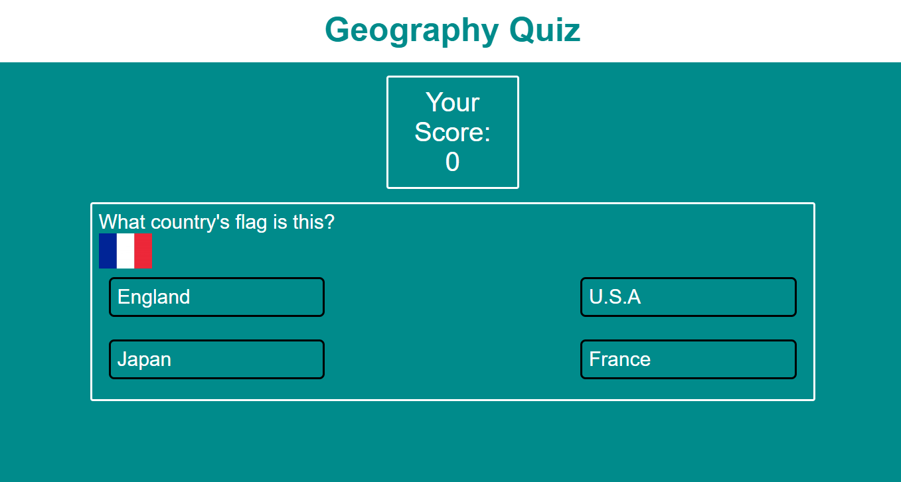
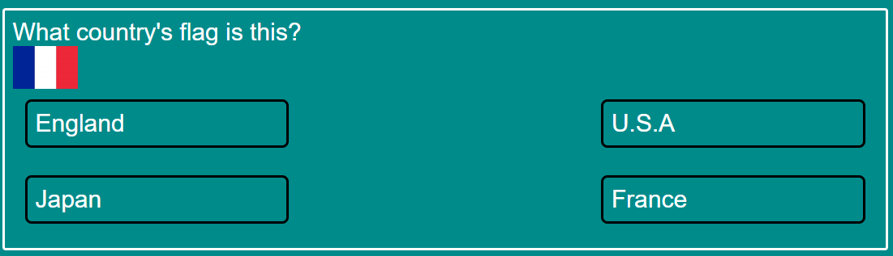

# Geography Quiz

A project made propting the user to complete a simple geography quiz. The user is given 5 questions to answer. Each question has 4 possible answers. The user must select an answer, and if right they will gain a point.This project is intended to be a fun little test for people interested in geography.

### Existing Features

- __The Heading__

  - Featured at the top of the page, the Geography Quiz heading is easy to see for the user. Upon viewing the page, the user will be able to see the name of the game.

- __The Question Area__

  - This section will allow the user to take part in the quiz. 
  - The user will be able to select their answer after reading the question.

- __The Scoreboard__

  - The scoreboard is where the user will be able to see their score as they are playing the game
  - It updates with every question the user completes.

### Features Left to Implement

- Add more questions
- Add numerical answer options

