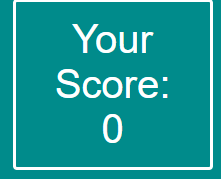

# Geography Quiz

A project made propting the user to complete a simple geography quiz. The user is given 5 questions to answer. Each question has 4 possible answers. The user must select an answer, and if right they will gain a point.This project is intended to be a fun little test for people interested in geography.

### Existing Features

- __The Heading__

  - Featured at the top of the page, the Geography Quiz heading is easy to see for the user. Upon viewing the page, the user will be able to see the name of the game.

- __The Question Area__

  - This section will allow the user to take part in the quiz. 
  - The user will be able to select their answer after reading the question.

- __The Scoreboard__

  - The scoreboard is where the user will be able to see their score as they are playing the game
  - It updates with every question the user completes.

### Features Left to Implement

- Add more questions
- Add numerical answer options

## Testing 

Tested website mysef firstly, by checking every possible outcome to see if any errors happen
I added function to the css file to make the fonts smaller should the screen size be reduced.

Noticed numerous syntax errors upon testin,maianly forgetting colons

### Validator Testing 

- HTML
    - No errors were returned when passing through the official [W3C validator](https://validator.w3.org/nu/?doc=https%3A%2F%2Fcode-institute-org.github.io%2Flove-maths%2F)
- CSS
    - No errors were found when passing through the official [(Jigsaw) validator](https://jigsaw.w3.org/css-validator/validator?uri=https%3A%2F%2Fvalidator.w3.org%2Fnu%2F%3Fdoc%3Dhttps%253A%252F%252Fcode-institute-org.github.io%252Flove-maths%252F&profile=css3svg&usermedium=all&warning=1&vextwarning=&lang=en)
- JavaScript
    - No errors were found when passing through the official [Jshint validator](https://jshint.com/)
      -There are 16 functions in this file.
      -Function with the largest signature take 1 arguments, while the median is 0.
      -Largest function has 7 statements in it, while the median is 6.
      -The most complex function has a cyclomatic complexity value of 6 while the median is 2..

### Unfixed Bugs
I would have liked to included more questions. I found that reducing to screen to a very small size will eventually make the answer buttons overlap. If they could be made to stack on top of eachother it would be better.

## Deployment

- The site was deployed to GitHub pages.  
  - In the GitHub repository, I navigated to the Settings tab 
  - From the source section drop-down menu,  I selected the Master Branch
  - Once the master branch was selected, the page automatically refreshed with a detailed ribbon display to indicate the successful deployment. 

The live link can be found here - https://liammahoney115.github.io/JavaScriptProject/

## Credits 

### Content 

- The information gathered for questions was taken from wikipedia
- Inspiration for the layout of the website was taken from https://www.youtube.com/watch?v=jaVNP3nIAv0&t=3376s

### Media

- The photo used on the quiz is from shutterstock

